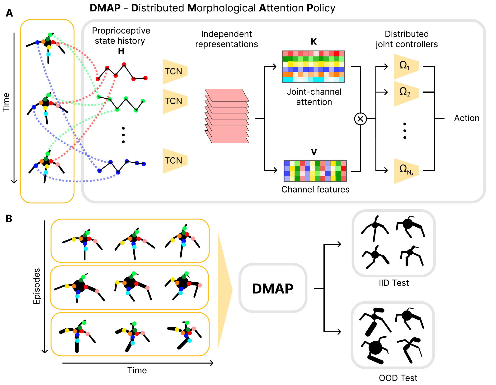

# DMAP: a Distributed Morphological Attention Policy for Learning to Locomote with a Changing Body


We introduce DMAP, a biologically-inspired, attention-based policy network architecture. DMAP combines independent proprioceptive processing, a distributed policy with individual controllers for each joint, and an attention mechanism, to dynamically gate sensory information from different body parts to different controllers (see diagram below). Despite not having access to the (hidden) morphology information, DMAP can be trained end-to-end in all the considered environments, overall matching or surpassing the performance of an oracle agent. Thus DMAP, implementing principles from biological motor control, provides a strong inductive bias for learning challenging sensorimotor tasks. Overall, our work corroborates the power of these principles in challenging locomotion tasks.

<p>

</p>

This repository presents the code for DMAP.

Check out our website for more details and videos: [DMAP](https://amathislab.github.io/dmap/)

## Example body morphologies and agent locomotion performance

[](https://youtu.be/zbsBw1ZCs9I "Example 1")
[](https://youtu.be/_RuMbCHVCsg "Example 1")

## Notes:

- Dec 2022: Check out this [EPFL news article](https://actu.epfl.ch/news/locomotion-modeling-evolves-with-brain-inspired-ne/) on our work! Also available in [French](https://actu.epfl.ch/news/faire-avancer-la-modelisation-de-la-locomotion/).
- Nov 2022: For testing our agents, we use a slightly adapted version of the Pybullet-M benchmark. Currently this benchmark code is integrated in our repository, but it will shortly be released as a stand-alone repository (stay tuned). For more information on the benchmark as well as baselines check out:
- Sept 2022: Paper accepted at [NeurIPS 2022](https://nips.cc/Conferences/2022/Schedule)!

Mann, K. S., Schneider, S., Chiappa, A., Lee, J. H., Bethge, M., Mathis, A., & Mathis, M. W. (2021, March). [Out-of-distribution generalization of internal models is correlated with reward.](https://openreview.net/forum?id=hR_TNbCr_nQ) In Self-Supervision for Reinforcement Learning Workshop-ICLR 2021.

## Installation and reproducing results

[Reproducing the results of the paper](REPRODUCING_RESULTS.md)

## Reference

Chiappa, A.S., Vargas, A.M. and Mathis, A., 2022. [DMAP: a Distributed Morphological Attention Policy for Learning to Locomote with a Changing Body. arXiv preprint arXiv:2209.14218.](https://arxiv.org/abs/2209.14218)

```
@article{chiappa2022dmap,
  title={DMAP: a Distributed Morphological Attention Policy for Learning to Locomote with a Changing Body},
  author={Chiappa, Alberto Silvio and Vargas, Alessandro Marin and Mathis, Alexander},
  journal={arXiv preprint arXiv:2209.14218},
  year={2022}
}
```
